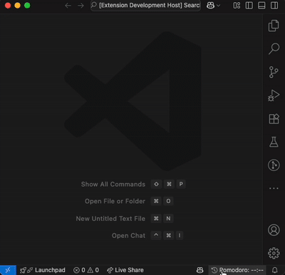
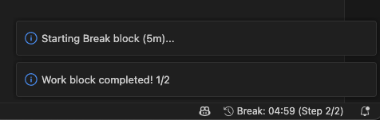

# Custom Pomodoro

This extension creates a pomodoro timer in the bottom right hand corner of VSCode. By clicking the timer you can view the web UI which lets you select custom or premade timers for both work and break time. You can also play, pause, resume, and reset the timer here.

When a timer is complete, a notification is displayed inside of VSCode to let you know that the timer has expired.

## Release Notes

Users appreciate release notes as you update your extension.

### 1.0.0

Initial release of Custom Pomodoro
